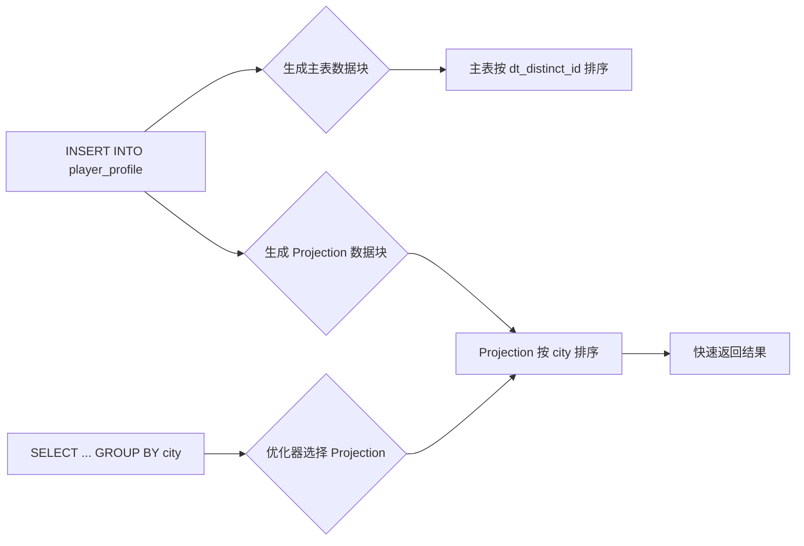

---

categories: [go]
layout: single
title: clickhouse 底层原理分享
---


## 大纲

[TOC]

## 一、引入

### 1. 什么是 ClickHouse？为什么我们需要 ClickHouse？

在数据驱动的游戏运营与广告投放中，我们每天面临着海量的数据洪流——
玩家的每一次 **登录、注册、充值、打开活动页面**，
广告在各渠道的每一次 **曝光、点击、转化、付费**……
这些行为数据源源不断地涌入我们的系统，日均数据量高达数千万甚至上亿条。

传统的数据库架构在面对如此大规模、高并发的分析场景时，逐渐暴露出瓶颈：
👉 查询响应缓慢，报表加载动辄几十秒；
👉 数据延迟严重，无法满足运营“实时看数”的需求；
👉 扩展成本高昂，硬件投入与性能提升不成正比。

而 **ClickHouse**，正是为解决这类高吞吐、低延迟分析场景而生的强大引擎。

> **ClickHouse** 是由俄罗斯公司 Yandex 开发的开源 **列式数据库管理系统（Column-Oriented DBMS）**，专为 **在线分析处理（OLAP）** 场景设计。它以“**极快的查询性能**”著称，能够在**秒级甚至毫秒级**内完成对**数亿行数据**的聚合统计，支撑高并发的即席查询。

在我们的 BI 系统中，ClickHouse 已成为两大核心模块的底层支柱：

### 🎯 1. 广告数据报表模块

我们对接了多个广告投放平台（如腾讯广告、字节巨量引擎、Google Ads 等），需要实时收集、归因并分析各渠道的投放效果。
借助 ClickHouse，我们实现了：

- 每分钟级的数据写入与可见性；
- 多维度下钻分析（按渠道、素材、广告位、地域等）；
- 实时监控 ROI、转化率等关键指标，支撑快速决策。

### 🎯 2. 用户行为分析模块

从玩家注册到充值的完整行为路径，都需要被高效追踪与分析。
ClickHouse 支撑我们：

- 快速计算 DAU、留存率、付费转化漏斗；
- 分析用户活跃度、行为路径、功能使用频次；
- 支持运营人员自助式探索分析。

------

✅ 正是由于这些**数据量大、写入高、查询实时性强**的核心诉求，我们选择了 ClickHouse 作为 BI 系统的分析底座——
它不仅提升了数据服务的响应速度，更让“数据驱动运营”真正落地。****

#### 🔍 为什么我们需要 ClickHouse？

- **速度快**：相比传统行式数据库，ClickHouse 在大数据量下的查询性能提升数十倍甚至上百倍。
- **高吞吐写入**：支持每秒数百万行的数据写入，适合日志、事件流等高频写入场景。
- **高压缩比**：列式存储 + 数据编码，显著降低存储成本。
- **实时分析能力**：无需预计算，支持即时查询，让数据分析更灵活。
- **简单易用**：兼容 SQL，学习成本低，集成方便。

👉 简单来说：**当你的数据量超过千万级，查询开始变慢，报表开始卡顿——就是时候考虑 ClickHouse 了。**

---

### 2. 本次分享的核心目标

本次分享，**不止于“如何使用 ClickHouse”**。

我们常常会遇到这样的情况：

> “我写了 SQL，数据也导入了，但为什么查询还是慢？”
> “主键和排序键到底有什么区别？”
> “为什么加了索引反而没效果？”

这些问题的背后，是对 ClickHouse **底层机制理解的缺失**。

因此，本次分享的核心目标是：

🎯 **做到三个“掌握”**：

1. **掌握 ClickHouse 为什么那么快？**
   —— 从列式存储、数据压缩、向量化执行到稀疏索引，揭开性能之谜。

2. **掌握 ClickHouse 的核心概念与架构**
   —— 理解 `MergeTree` 引擎、`PRIMARY KEY`、`ORDER BY`、分区、数据跳过索引等关键设计背后的逻辑。

3. **掌握 SQL 背后发生了什么？**
   —— 当你执行一条 `SELECT` 语句时，ClickHouse 如何扫描数据、如何利用索引、如何合并分区……我们将深入执行流程，**知其然，更要知其所以然！**

---

### 3. 分享结构概览

为了让理解更系统，本次分享将分为以下几个部分：

1. **ClickHouse 核心原理**
   —— 列式存储、向量化执行、分区、排序与主键设计
2. **数据建模**
   —— 物化视图、投影
3. **实战案例解析**
   —— 从建表、导入、查询，结合真实场景看sql背后发生的事情

---

### ✅ 你将收获什么？

- 不再“盲调”参数，而是理解每项配置的意义；
- 能够设计出高性能的表结构与索引策略；
- 面对慢查询时，具备分析与优化的能力；
- 真正掌握 ClickHouse 的“思维方式”。

---


## 二、核心概念

### 2.1 数据组织结构

在开始了解并掌握clickhouse的一些核心概念之                     前，我们需要了解clickhouse的数据组织形式，如何保存在磁盘中的。


在clickhouse的数据目录中，我们关注两个目录，一个是data，一个是store

- data 是旧版clickhouse 存储数据的目录
- store 是新版本clickhouse 存储数据的目录

因为旧版方便今天的讲解，所以我们就看data目录。

1. 可以看到data目录中有两个文件夹，一个是default，一个是system，这两个文件夹对应的就是两个数据库。都是clickhouse自带的。
2. 在default中，我们可以看到两个两个文件夹，分别叫 `hits_UserID_URL`  ,`trips`，这两个文件夹中对应的是我在这个库中创建的两张表。
3. 在trips文件夹中，我们可以看到很多子目录，这些子目录，就是这张表中的数据，每一个目录叫做一个`part` ,后面我会讲解这个`part` 是什么东西。


好了，到此为止，恭喜你，你已经基本了解了clickhouse的数据的组织形式了。虽然详细的组织形式还没有拆解，但是可以应付我接下来的讲解了。 


### 2.2 列式存储

在了解了 ClickHouse 的数据是按 `part` 组织之后，我们再深入一步：**每个 part 里面的文件长什么样？它是如何存储数据的？**

答案就是：**列式存储（Column-Oriented Storage）**。

------

#### 📦 2.2.1 什么是列式存储？

我们先来看一个例子。

假设有一张表 `trips`，包含以下数据：

| dt_distinct_id | dt_part_date     | city | distance |
| -------------- | ---------------- | ---- | -------- |
| user_001       | 2025-08-30 10:00 | 北京 | 15.3     |
| user_002       | 2025-08-30 10:05 | 上海 | 8.7      |
| user_003       | 2025-08-30 10:10 | 北京 | 22.1     |

##### 🔹 行式存储（Row-Based）——如 MySQL

数据按“行”组织，连续存储：

```
[user_001, 2025-08-30 10:00, 北京, 15.3]
[user_002, 2025-08-30 10:05, 上海, 8.7]
[user_003, 2025-08-30 10:10, 北京, 22.1]
```

##### 🔹 列式存储（Column-Based）——如 ClickHouse

数据按“列”组织，每列独立存储：

```
dt_distinct_id.bin:   user_001 → user_002 → user_003
dt_part_date.bin:     2025-08-30 10:00 → 2025-08-30 10:05 → 2025-08-30 10:10
city.bin:             北京 → 上海 → 北京
distance.bin:         15.3 → 8.7 → 22.1
```

> ✅ 在磁盘上，每一列都对应一个独立的 `.bin` 文件，存储该列的所有值。

------

#### 🔍 2.2.2 回到我们的数据目录

再次打开 `trips` 表下的某个 `part` 目录，你会看到类似这样的文件结构：

```
trips/
└── 20250830_1_1_0/                ← 一个 part
    ├── dt_distinct_id.bin
    ├── dt_part_date.bin
    ├── city.bin
    ├── distance.bin
    ├── primary.idx                ← 稀疏索引（基于排序键）
    └── ...
```

📌 每个 `.bin` 文件就是某一列的**压缩后数据流**，按顺序存储该列所有行的值。

------


#### ✅ 2.2.3 列式存储的核心优势

为什么分析型数据库（如 ClickHouse）要用列式存储？因为它特别适合**大表聚合查询**。

##### 1. 减小IO

| 场景                                                         | 行式存储                      | 列式存储                                       |
| ------------------------------------------------------------ | ----------------------------- | ---------------------------------------------- |
| `SELECT city, distance FROM trips WHERE dt_distinct_id = 'user_001'` | 读整行，效率尚可              | 只读 `city` 和 `distance` 列，跳过其他列       |
| `SELECT avg(distance) FROM trips`                            | 读整行，但只用一列 → 浪费 I/O | **只读 `distance.bin` 文件**，其他列完全不加载 |
| `SELECT city, count(*) FROM trips GROUP BY city`             | 读整行，解包所有字段          | 只读 `city` 列，内存占用小，速度快             |

> 🎯 **关键点：分析查询通常只涉及少数几列，列式存储可以跳过无关列，极大减少 I/O 和内存消耗。**


##### 2. 压缩效率更高

因为同一列的数据类型相同、值相近（尤其是排序后），**压缩率极高**！

例如：

- `city` 列中“北京”重复出现，可以用字典压缩；
- `distance` 是浮点数序列，可以用差值编码 + LZ4 压缩；
- 压缩比通常可达 **5:1 甚至 10:1**，节省大量磁盘空间。


#### 🔍 2.2.4 数据插入原理


到这里，请记住一个关键点，每一次数据的插入，都会经历一个标准的流程：

1. 将行数据转换为列数据
2. 将每一列数据压缩
3. 将压缩好的数据存到磁盘。每一列数据命名为：*.bin

这样就完成了一个基本的流程。（后续还有其他流程加入到这里面）


### 2.3  parts（数据块）

在了解了 ClickHouse 的数据是如何存储在磁盘上（即以 `part` 为单位组织），以及其列式存储之后，我们继续来了解`part`

---

#### 2.3.1 什么是 `part`？

在 ClickHouse 中，**每一次数据插入操作，并不会直接“追加”到表里**，而是会生成一个**独立的、不可变的数据片段**——这就是 `part`（中文常译为“数据块”或“分片”）。

> 🔹 **`part` 是 ClickHouse 数据在磁盘上的最小存储和管理单位。**

你可以把它想象成：

> “一次写入，就生成一个‘数据包裹’，这个包裹一旦封箱，就不能再打开修改。”


#### 2.3.2 一次插入，如何变成一个 `part`？

当我们向一个表中插入 10 条数据时（哪怕只有 10 条），ClickHouse 内部会经历以下四个步骤：

##### 1️⃣ 排序（Sort）

- 数据会先按照表定义中的 **排序键（ORDER BY）** 进行物理排序；
- 同时生成一个**稀疏主索引（Sparse Primary Index）**，用于后续快速查询。

> 后续会讲解这个排序和稀疏索引，这里先不用关心。

##### 2️⃣ 拆分（Split by Column）

- 排序完成后，数据会被**按列拆分**；
- 每一列的数据独立组织，为列式存储做准备。

##### 3️⃣ 压缩（Compress）

##### 4️⃣ 写入磁盘（Write to Disk）

- 将压缩后的列数据、索引、元数据等，**整体写入一个新目录**；
- 这个目录的名字就是这个 `part` 的标识，比如：`20250831_1_1_0/`。

```
trips/
└── 20250831_1_1_0/                ← 一个 part
    ├── dt_distinct_id.bin         ← 压缩后的列数据
    ├── dt_part_date.bin
    ├── city.bin
    ├── distance.bin
    ├── primary.idx                ← 稀疏主索引
    ├── checksums.txt              ← 文件校验和
    ├── columns.txt                ← 列信息
    └── part_type.txt              ← part 类型（Wide / Compact）
```

> ✅ **每个 `part` 都是自包含的**：它包含了读取和解释自身所需的一切信息，**不需要依赖外部“中央目录”或“元数据服务”**。

------

#### 2.3.3 可视化示意


------

#### 2.3.4 `part` 的核心特性

| 特性                    | 说明                                                         |
| ----------------------- | ------------------------------------------------------------ |
| **不可变（Immutable）** | 一旦生成，`part` 就不能再修改。更新或删除操作通过标记旧 part + 写新 part 实现。 |
| **独立完整**            | 每个 `part` 包含数据、索引、元数据，可独立读取。             |
| **内部有序**            | 数据在 `part` 内部按排序键物理有序，支持稀疏索引跳过。       |
| **可合并（Mergeable）** | 后台会定期将多个小 `part` 合并为大 `part`，减少碎片。        |

------


#### 2.3.5 为什么设计成 `part`？

ClickHouse 是为**高性能分析查询**设计的，而 `part` 机制带来了三大优势：

1. **写入高效**
   → 每次写入只需生成一个新 `part`，无需随机写或锁表，支持高并发批量写入。
2. **查询可优化**
   → 每个 `part` 内部有序 + 有索引，查询时可以跳过无关数据； → 分区表还能跳过整个 `part`（分区裁剪）。
3. **易于管理与恢复**
   → `part` 是原子单位，备份、复制、删除都以 `part` 为粒度； → 即使崩溃，未完成的 `part` 也不会污染已有数据。


### 2.4 Granule：数据读取的最小单位

在了解了 `part` 是 ClickHouse 的**磁盘存储单元**之后，我们再深入一层，看看 ClickHouse 是如何在**内存中处理和读取数据**的。

这就引出了另一个核心概念：**granule（颗粒）**。

granule 是 ClickHouse 实现**高效查询跳过与快速数据定位**的关键粒度。理解它，是理解稀疏索引、数据压缩与 I/O 优化的基础。

------

#### 2.4.1 什么是 Granule？

- `granule` 是 ClickHouse **数据读取和索引的基本单位**；
- 每个 `part` 会被划分为多个 `granule`；
- 每个 `granule` 默认包含 **8192 行数据**（可通过表引擎参数 `index_granularity` 配置）；
- 数据按列存储，每个 `granule` 对应的列数据会被**一起压缩、一起读取**。

> 📌 类比理解：
>
> - `part` 就像一个“文件夹”（磁盘上的目录）；
> - `granule` 就像文件夹里的“数据块”（逻辑上的读取单元）；
> - 每个列的 granule 数据存储在 `.bin` 文件中，连续排列。

------

#### 2.4.2 Granule 的划分示意图

假设一个 `part` 中，`dt_distinct_id` 这一列有 25,000 行数据：

```
Part: 20250831_1_1_0/dt_distinct_id.bin
├── [Granule 1]  行 0 ~ 8191     ← 8192 行
├── [Granule 2]  行 8192 ~ 16383 ← 8192 行
└── [Granule 3]  行 16384 ~ 24999 ← 8616 行（最后一块可能不满）
```

> ⚠️ 注意：
>
> - `granule` 是**逻辑划分**，不会在磁盘上生成独立文件或目录；
> - 但它决定了**数据读取、压缩、索引和跳过的最小粒度**。

------

#### 2.4.3 为什么需要 Granule？

| 目标               | Granule 如何实现                                             |
| ------------------ | ------------------------------------------------------------ |
| **减少 I/O**       | 查询时可跳过整个 granule，避免加载无关数据                   |
| **控制索引大小**   | 稀疏主键索引只需为每个 granule 记录一个值（第一行的主键），而不是每行都记 |
| **平衡性能与内存** | 8192 是经验值：太小 → 索引膨胀；太大 → 跳过精度低            |

> 💡 简单说：**granule 是 ClickHouse 实现“精准跳过 + 高效读取”的标尺。**

------


#### 2.4.4 Granule 的底层实现：`.cmrk` 文件与数据定位

当你向 ClickHouse 插入数据时，系统不仅会将数据按 `part` 组织、按列压缩，还会为每一列创建一个关键的**辅助索引文件**，用于快速定位 granule 在压缩流中的位置。

这个文件就是：**`.cmrk` 文件**（全称：*compressed mark* 文件）。

------

##### 🧩 `.cmrk` 文件的作用

由于每一列的数据是**压缩后连续存储**在 `.bin` 文件中的，而压缩会改变数据长度，因此无法直接通过“行号”计算出数据在文件中的偏移量。

为了解决这个问题，ClickHouse 为每个 `granule` 创建一个“标记”（mark），记录两个关键偏移量：

| 字段             | 含义                                                  |
| ---------------- | ----------------------------------------------------- |
| `block_offset`   | 该 granule 在**压缩数据流**中的起始位置（字节偏移）   |
| `granule_offset` | 该 granule 在**未压缩数据**中的起始行号（逻辑行偏移） |

> 📁 文件命名：
> 对于列 `dt_distinct_id`，对应的 `.cmrk` 文件名为 `dt_distinct_id.mrk2` 或 `dt_distinct_id.mrk3`（版本不同，后缀不同，但作用一致）。

------

##### 🔍 举个例子：如何通过 `.cmrk` 读取第 9000 行？

1. 系统知道每 `granule` 包含 8192 行；

2. 第 9000 行属于 **第 2 个 granule**（行号 8192 ~ 16383）；

3. 查找

   ```
   dt_distinct_id.mrk2
   ```

   文件的第 2 条记录：

   ```
   granule_index | block_offset | granule_offset
   0             | 0            | 0
   1             | 1024         | 8192     ← 第2个 granule
   ```

4. 得知该 granule 在 `.bin` 文件中从 **偏移 1024 字节**处开始；

5. 从该位置读取压缩数据块，解压后获取 8192 行原始值；

6. 取出其中第 `(9000 - 8192) = 808` 个值，即为目标数据。

> ✅ 这个过程实现了：**“通过逻辑行号 → 定位压缩流 → 精准读取”**。

------

##### 🖼️ 图示：`.bin` 与 `.cmrk` 的对应关系

```
Column: dt_distinct_id

[.bin 文件 - 压缩数据]
| 压缩块1 (8192行) | 压缩块2 (8192行) | 压缩块3 (8616行) |
▲                 ▲                 ▲
|                 |                 |
[.cmrk2 文件 - 标记]
| block_offset=0  | block_offset=1024 | block_offset=2560 |
| granule=0       | granule=8192      | granule=16384     |
```

> 📌 `.cmrk` 文件就像一张“地图”，告诉 ClickHouse：“第 N 个 granule 的数据，在压缩文件的哪个字节开始”。


#### 2.4.5 小结：Granule 的核心价值

- `granule` 是 ClickHouse **数据读取和跳过的最小逻辑单位**；
- 默认 8192 行一个 granule，可在建表时调整；
- 每个 granule 对应一个 `.cmrk2`（或 `.cmrk3`）标记文件条目；
- `.mrk2` 记录 `block_offset`（压缩位置）和 `granule_offset`（逻辑行号），实现**精准数据定位**；
- 它是连接“稀疏索引”与“物理读取”的桥梁，支撑了 ClickHouse 的高效查询。

> 💡 记住一句话：
> **“没有 granule，就没有数据跳过；没有 .cmrk，就没有快速定位。”**


### 2.5 主键索引和排序键

在 2.3 节中，我给各位挖了一个坑，这个坑就是，每一个part在形成的时候，第一步就是排序。那么你肯定有疑问，怎么排序，基于什么排序，现在就来填这个坑。


------

#### 2.5.1  什么是排序键（Sorting Key）？

当你创建一张表时，会使用 `ORDER BY (col1, col2, ...)` 来指定**排序键**。

```
CREATE TABLE trips (
    dt_distinct_id String,
    dt_part_date DateTime,
    city String,
    distance Float64
) ENGINE = MergeTree
ORDER BY (dt_distinct_id, dt_part_date);  -- 这就是排序键
```

📌 **作用：me**

- 数据在每个 `part` 内部会按照 `ORDER BY` 指定的列进行**物理排序**；
- 相同或相近值的数据会被聚集在一起，形成“数据局部性”。

> ✅ 举例：所有 `dt_distinct_id = 'user_123'` 的记录会集中存储，便于快速查找。

------


####  2.4.2 什么是主键索引（Primary Key）？

主键索引是基于排序键构建的一种 **稀疏索引（Sparse Index）**，它是 ClickHouse 实现高性能查询的核心机制之一。

##### ✅ 创建方式：

你可以显式定义主键：

```
PRIMARY KEY dt_distinct_id
```

也可以不写，ClickHouse 默认将 `ORDER BY` 的前缀作为主键。

> ⚠️ 注意：在 `MergeTree` 系列引擎中，**主键就是排序键的前缀**，两者通常是一致的。

主键索引在我们的数据目录中的对应的就是这个`primary.idx` 文件。

~~~bash
trips/
└── 20250831_1_1_0/                ← 一个 part
    ├── dt_distinct_id.bin         ← 压缩后的列数据
    ├── dt_part_date.bin
    ├── city.bin
    ├── distance.bin
    ├── primary.idx                ← 稀疏主索引
    ├── checksums.txt              ← 文件校验和
    ├── columns.txt                ← 列信息
    └── part_type.txt              ← part 类型（Wide / Compact）
~~~


#### 2.3.3  主键索引是如何生成的


这里继续留下一个坑，这个稀疏索引是如何提高clickhouse的查询速度的。后面会给大家填上。


##### 主键索引如何提高查询速度 动画演示


- **稀疏主索引**可帮助 ClickHouse 跳过不必要的数据，方法是识别哪些颗粒可能包含与主键列上的查询条件匹配的行。
- **每个索引仅存储每个颗粒**(一个颗粒默认有 8,192 行)第一行的主键值，使其足够紧凑以适应内存。
- ^^MergeTree^^ 表中的**每个数据部分都有自己****的主索引**，在查询执行期间独立使用。
- 在查询过程中，索引可以让 ClickHouse**跳过粒度**，减少 I/O 和内存使用，同时加速性能。
- 您可以使用表函数**检查索引内容**`mergeTreeIndex`，并使用子句监视索引使用情况`EXPLAIN`。


### 2.6 part merge（数据块的合并）

在 2.3 节 中，我们了解到：

> **每一次 `INSERT` 操作，都会生成一个新的 `part`** —— 它是一个独立、有序、压缩、不可变的数据单元。

这带来了一个问题：

> 🤔 **如果频繁插入数据，比如每秒一次，那岂不是会产生成千上万个 `part`？**
> 查询时要扫描这么多目录，性能会不会急剧下降？

答案是：**会！但 ClickHouse 早已为此设计了解决方案 —— `Part Merge`（数据块合并）。**

#### 2.6.1 什么是 Part Merge？

**Part Merge** 是 ClickHouse 后台自动执行的一个核心机制：

> **它会定期将多个小的 `part` 合并成一个更大的 `part`，从而减少 `part` 的总数，提升查询效率。**

这个过程是：

- ✅ **自动的**：无需人工干预；
- ✅ **异步的**：在后台运行，不影响正常查询和写入；
- ✅ **不可见的**：对用户透明，表的数据始终可查。

------

#### 2.6.2 合并过程详解

当 Merge 进程启动时，它会执行以下步骤：

1. **选择候选 part**
   → 根据大小、数量、写入时间等策略，选出一批可以合并的小 `part`。
2. **读取并排序数据**
   → 将这些 `part` 中的数据按**排序键（ORDER BY）** 重新归并排序（类似归并排序）； → 确保合并后的新 `part` 依然保持全局有序。
3. **去重与清理（可选）**
   - 如果启用了 `ReplacingMergeTree`，重复数据会被删除；
   - 已标记删除的行（如 TTL 过期）也会被清理。
4. **列式压缩与写入**
   → 按列拆分 → 压缩 → 写入一个新的、更大的 `part` 目录。
5. **原子替换与清理**
   → 新 `part` 写入完成后，原子性地替换旧的多个 `part`； → 旧 `part` 被标记为“待删除”，默认 **8 分钟后** 从磁盘删除（可通过 `old_parts_lifetime` 配置）。


#### 2.6.3 合并过程图解


#### 2.6.4 合并详细分类


##### 1. 标准版


##### 2.  ReplacingMergeTree


[ReplacingMergeTree 表引擎](https://clickhouse.com/docs/zh/engines/table-engines/mergetree-family/replacingmergetree)允许对行执行更新操作，无需使用低效的`ALTER`或`DELETE`语句，用户可以插入多份相同的行，并将其中一份标记为最新版本。后台进程异步移除同一行的旧版本，通过使用不可变的插入高效地模拟更新操作。

这依赖于表引擎识别重复行的能力。通过使用`ORDER BY`子句来确定唯一性，即如果两行在`ORDER BY`中指定的列的值相同，则它们被视为重复。定义表时指定的`version`列允许在识别到两行重复时保留最新版本，即保留版本值最高的行。


##### 3. SummingMergeTree


##### 4. AggregatingMergeTree


### 2.7 Partitions：数据分区与高效管理

在前面我们已经了解了：

- ClickHouse 的数据以 `part` 为单位存储；
- 每个 `part` 内部有序，通过稀疏索引加速查询；
- 后台会自动合并小 `part` 以优化性能。

但当数据量非常大时（比如 TB 级别），即使有 `part` 和索引，查询仍然可能变慢。
 这时，我们就需要一个更高层次的组织方式：**分区（Partition）**。

------

#### 2.7.1 什么是分区（Partition）？

**分区（Partitions）将 MergeTree 引擎族表中的数据块（data parts）分组为有组织的、逻辑上的单元。这是一种在概念上有意义的数据组织方式，它按照特定的标准进行划分，例如时间范围、类别或其他关键属性。这些逻辑单元使得数据更易于管理、查询和优化。**

启用分区之后，

**分区是将一张表的数据按某个规则（如时间、地区等）逻辑划分成多个组，每个组称为一个“分区”**。

你可以把它理解为：

> “**文件夹中的文件夹**”
> 表 → 分区 → part → granule → 行

当你使用 `PARTITION BY` 创建表时，ClickHouse 会为每个分区创建一个独立的目录，所有属于该分区的 `part` 都会存放在这个目录下。同时clickhouse会为每个数据部分创建一个MinMax索引，用来记录这部分数据中的最大值和最小值。

------

#### 2.7.2 如何定义分区？

使用 `PARTITION BY` 子句指定分区键：

```
CREATE TABLE trips (
    dt_distinct_id String,
    dt_part_date DateTime,
    city String,
    distance Float64
) ENGINE = MergeTree
PARTITION BY toYYYYMMDD(dt)  -- 按天分区
ORDER BY (dt_distinct_id, dt_part_date);
```

常见分区策略：

- `toYYYYMM(dt)` → 按年月分区（最常见）
- `toYYYYMMDD(dt)` → 按天分区
- `city` → 按城市分区
- `(country, region)` → 多级分区

------

#### 2.7.3 分区的目录结构

插入数据后，你会在表目录下看到类似这样的结构：

```
trips/
├── 2020-12-01/                    ← 分区目录（2020年12月1日）
│   ├── 20250831_1_1_0/        ← part
│   └── 20250831_2_2_0/        ← part
├── 2020-12-02/                    ← 分区目录（2020年12月2日）
│   ├── 20250701_3_3_0/
│   └── 20250702_4_4_0/
└── ... 
```

> ✅ **每个分区是一个独立的子目录，包含该时间段（或类别）的所有 `part`。**


------

#### 2.7.4 分区与 Part Merge 的关系

**Merge（合并）只在同一个分区内进行！**

也就是说：

- `2020-12-01` 分区内的 `part` 可以互相合并；
- `2021-01-01` 分区内的 `part` 可以互相合并；
- ❌ 但 `2020-12-01` 和 `2021-01-01` 的 `part` **永远不会合并**。


> 📌 这意味着：**分区是 Merge 的边界**。

------


#### 2.7.5 分区如何工作？—— 写入流程

当你向一张带分区的表插入数据时，流程如下：

1. **确定分区**
   → 根据 `PARTITION BY` 表达式计算该行属于哪个分区（如 `toYYYYMM('2025-08-31') = 202508`）；
2. **排序与拆列**
   → 在内存中对该批数据按 `ORDER BY` 排序，拆分为列；
3. **压缩并写入**
   → 将生成的 `part` 写入对应分区的目录中。

> ✅ 所以：**分区是在写入时决定的，一旦写入，数据就不能跨分区移动**（除非手动 `ALTER ... MOVE PARTITION`）。


#### 2.7.6 分区的核心作用

虽然分区也能提升查询性能，但它的主要价值在于 **数据管理**。

| 作用                              | 说明                                                         |
| --------------------------------- | ------------------------------------------------------------ |
| ✅ **1. 数据管理（核心用途）**     | - 按时间删除旧数据：`ALTER TABLE trips DROP PARTITION 202507` <br />- 快速移动数据到不同磁盘：`ALTER ... MOVE PARTITION ... TO DISK`- 备份/恢复更精细：可以只操作某个分区 |
| ⚡ **2. 提升查询性能（辅助用途）** | - 查询时自动跳过无关分区（**分区裁剪，Partition Pruning**）<br>- 减少需要扫描的 `part` 数量 |

------


#### 2.7.7 分区裁剪（Partition Pruning）

这是分区对查询性能的最大贡献。

当你的查询包含分区键条件时，ClickHouse 会**自动跳过不相关的分区**。

```sql
-- 查询 8 月的数据
SELECT * FROM trips 
WHERE dt_part_date >= '2025-08-01' 
  AND dt_part_date < '2025-09-01';
```

ClickHouse 会：

1. 计算出只扫描 `202508` 分区；
2. 完全跳过 `202507`、`202506` 等其他分区；
3. 大幅减少 I/O 和计算量。

> 📊 效果：查 1 天数据，只扫 1 个分区，而不是全表 30 个分区。


#### 2.7.8  分区使用注意事项

| 注意事项                   | 说明                                                         |
| -------------------------- | ------------------------------------------------------------ |
| **不要过度分区**           | 如按 `toYYYYMMDDHH` 分小时，会导致 `part` 和分区过多，增加元数据压力 |
| **避免单分区过大**         | 建议单个分区大小控制在 **10GB ~ 100GB** 之间                 |
| **分区键应与查询模式匹配** | 如果常按城市查，就按 `city` 分区；如果常按时间查，就按时间分区 |
| **分区合并独立进行**       | 小分区可能长期不合并，需监控 `system.parts`                  |

#### 

------

#### ✅ 小结

- **分区是 ClickHouse 中对 `part` 的逻辑分组**，用于组织大规模数据；
- 使用 `PARTITION BY` 定义，每个分区有独立目录；
- **Merge 只在分区内部进行**，分区是合并的边界；
- 核心价值是 **数据管理**（删除、移动、备份）；
- 附带价值是 **分区裁剪**，可显著提升查询性能；
- 设计分区时要平衡粒度：**太细 → 碎片多；太粗 → 跳过不精准**。

> 💡 记住一句话：
> **“分区是管理的利器，不是查询的银弹。”**
> 它最适合用于**按时间清理日志、快速恢复特定时段数据**等运维场景。


## 三、数据建模

### 3.1 物化视图（增量物化视图）

#### 3.1.1  什么是物化视图？解决了什么问题？

##### 🎮 案例1：双重视角的数据查询难题

在我们的游戏运营后台中，有一张记录所有玩家基础信息和行为标签的宽表 `player_profile`，该表的排序键是`dt_distinct_id`

现在运营团队经常需要做两件事：

1. ✅ **按“玩家ID”查询某个玩家的详细信息**
   → 比如客服要查 `player_10086` 的等级和城市，这个很常见，也很快。
2. ❌ **按“城市”统计各城市的玩家人数分布**
   → 比如运营想看“北京、上海、广州分别有多少玩家”，以便决定线下推广策略。需要扫描整张表的数据。

~~~sql
SELECT city, count(*) AS player_count 
FROM player_profile 
GROUP BY city;
~~~


> 🤔 有没有一种方案，让我们：
>
> - 查单个玩家时，数据按 `dt_distinct_id` 组织，速度快；
> - 统计城市分布时，数据又像是按 `city` 预先排序好的，也能秒出结果？


##### 🎮案例2：玩家充值排行榜的性能瓶颈

你每天都要做一份“玩家充值排行榜”，统计每个玩家的总充值金额。

~~~sql
SELECT dt_distinct_id, sum(money) FROM user_events GROUP BY dt_distinct_id;
~~~

随着数据量的增加会发生什么？

- 刚开始数据量小（百万级），查询只要1秒。
- 但随着游戏上线时间增长，数据量达到**数亿条**，这个查询可能要几十秒甚至更久。
- 更糟的是：这个排行榜每天都要看，每次都要重新算一遍，**重复计算，浪费资源**。


> 🤔 有没有一种方案：能让这个结果“**提前算好**”，并且“**新充值一进来就自动更新**”？


#### 3.1.2 物化视图的原理

带着上面的两个问题，我们就来看这个物化视图的原理。

当我们在创建一张数据表的时候，我们可以基于这张数据表，创建一张“物化视图”。这张数据表通常称为：*源表*， 这个物化视图我们成为：*目标表*  


当我们创建一个物化视图的时候，我们需要根据我们的业务需求定义哪些东西：

- ##### ✅ `SELECT` 逻辑：你想“提前算什么”？

- ##### ✅ 排序方式（`ORDER BY`）：你怎么组织结果数据？

- ##### ✅ 使用的引擎（Engine）：你希望怎么存储和合并结果？


接下来让我们看两一段创建物化视图的SQL：

##### 创建物化视图

~~~sql
-- 创建主表：存储所有用户事件（登录、注册、充值等）
CREATE TABLE user_events (
    dt_distinct_id String,           -- 用户唯一ID
    dt_part_event String,            -- 事件类型：'用户注册', '充值成功', '登录' 等
    dt_part_date DateTime,           -- 事件发生时间
    campaign_id String,              -- 广告投放渠道ID（如：ads_tencent, ads_byte）
    city String,                     -- 用户所在城市
    money Float64 DEFAULT 0.0        -- 充值金额（非充值事件为0）
) ENGINE = MergeTree
ORDER BY (dt_distinct_id, dt_part_date)  -- 按用户ID和时间排序，适合查询单用户行为
PARTITION BY toYYYYMM(dt_part_date)      -- 按月分区，便于管理历史数据
TTL dt_part_date + INTERVAL 180 DAY      -- 数据保留180天（可选）
SETTINGS index_granularity = 8192;
~~~


~~~sql
-- 创建物化视图：按广告渠道和日期统计每日注册数和总充值金额
CREATE MATERIALIZED VIEW mv_ad_daily_summary
(
    stat_date Date,                    -- 统计日期
    campaign_id String,                -- 渠道ID
    register_count UInt64,             -- 注册人数
    total_revenue Float64              -- 总收入
)
ENGINE = SummingMergeTree  -- 关键：使用 SummingMergeTree 自动合并相同主键的聚合值
ORDER BY (stat_date, campaign_id)     -- 按日期+渠道排序，适合多维分析
SETTINGS index_granularity = 8192
AS
SELECT
    toDate(dt_part_date) AS stat_date,           -- 转换时间为日期
    campaign_id,
    count(*) AS register_count,                  -- 统计注册事件数量
    sum(money) AS total_revenue                  -- 累加充值金额
FROM user_events
WHERE dt_part_event = '用户注册'                 -- 只处理注册和充值事件
   OR dt_part_event = '充值成功'
GROUP BY stat_date, campaign_id;
~~~


#### 3.1.3 工作原理图


#### 3.1.4 物化视图的优点

##### ✅ 1. **解决“大表聚合慢”的性能瓶颈**

在亿级数据表上执行 `GROUP BY`、`SUM`、`COUNT` 等聚合操作，查询延迟高、资源消耗大。
 物化视图通过**提前计算并存储结果**，将“运行时计算”转化为“写入时预计算”，使复杂查询变为对小表的快速扫描，查询性能从秒级降至毫秒级。

> 🎯 适用场景：每日活跃用户（DAU）、充值总额、注册转化率等高频聚合指标。

------

##### ✅ 2. **解决“重复计算”的资源浪费问题**

同一个聚合逻辑（如“按城市统计玩家数”）被多个报表、接口反复调用，导致数据库不断重复扫描相同数据。
 物化视图将结果**只算一次，多次复用**，极大减少 CPU、I/O 和内存开销，提升系统整体资源利用率。

> 🎯 本质：**用存储换计算**，以少量额外存储空间，换取巨大的查询性能提升。

------

##### ✅ 3. **解决“实时分析”的时效性挑战**

传统 T+1 或定时调度的 ETL 方式无法满足运营对“分钟级数据可见性”的要求。
 物化视图基于**增量更新机制**，在新数据写入源表的同时自动更新结果，实现“**数据写入即可见**”，支撑实时监控、广告归因、动态排行榜等近实时业务。

> 🎯 特点：无需定时任务，无需外部调度，数据链路自动闭环。

------

##### 🧩 物化视图的本质总结

> **物化视图 = 预计算逻辑 + 自动更新管道 + 物理存储表**

它不是简单的“视图”，而是一个**由数据库自动维护的、轻量级的衍生结果表**，专为加速特定查询模式而生。

#### 

#### 3.1.5 物化视图的不足

尽管物化视图在提升查询性能、减少重复计算、实现近实时分析方面表现出色，但它也并非“银弹”。作为一种典型的 **“以空间换时间”** 的解决方案，它在带来性能优势的同时，也引入了一些**限制与代价**。

以下是使用物化视图时必须注意的几点不足：

------

##### ❌ 1. **增加存储开销（空间换时间的代价）**

物化视图会将预计算的结果**持久化存储为一张物理表**，这意味着：

- 每个物化视图都会占用额外的磁盘空间；
- 如果源表数据量大、聚合粒度细，物化视图可能仍然很大；
- 多个物化视图叠加使用时，存储成本会线性增长。

> 💾 举例：一张 100GB 的原始日志表，创建 3 个按不同维度聚合的物化视图，可能额外增加 30~60GB 存储。

> 📌 **建议**：定期评估物化视图的使用频率，及时清理不再需要的 MV，避免“数据堆积”。

------

##### ⚠️ 2. **写入延迟增加（影响数据写入性能）**

物化视图的“自动更新”机制是在**源表写入时触发的**，因此：

- 每次向源表 `INSERT` 数据，ClickHouse 都要同步执行聚合计算，并写入物化视图；
- 这会延长 `INSERT` 的响应时间，增加写入延迟；
- 在高并发写入场景下，可能成为写入瓶颈。

> ⚡ 影响程度取决于：
>
> - 聚合逻辑的复杂度（`GROUP BY` 字段越多越慢）；
> - 是否涉及多表 JOIN；
> - 写入批次的大小。

> 📌 **建议**：避免在物化视图中使用复杂 JOIN 或嵌套子查询；优先用于批量写入场景，而非高频小批量插入。

------

##### 🔄 3. **更新逻辑固定，灵活性差**

物化视图的聚合逻辑在创建时就已确定，**一旦创建，难以动态修改**：

- 修改聚合字段、过滤条件或分组维度，必须重建物化视图；
- 重建过程可能耗时较长，期间无法使用；
- 不支持“临时调整查询逻辑”的灵活分析需求。

> 🆚 对比：直接查询源表可以随时调整 `WHERE`、`GROUP BY`、`ORDER BY`，而物化视图只能服务于**预设的查询模式**。

> 📌 **建议**：物化视图适合**稳定、高频、模式固定**的查询场景，不适合探索性分析。

------

##### 🧩 4. **数据一致性依赖写入路径（易出错）**

物化视图的数据更新**只对通过指定引擎表写入的数据生效**。

常见陷阱：

- 如果你绕过物化视图定义的“驱动表”，直接向源表插入数据，**物化视图不会更新！**
- 使用 `INSERT INTO source_table` 而不是 `INSERT INTO mv_driver_table`，会导致数据不一致。

> 🔁 正确写入路径：
>
> ```
> INSERT → 驱动表（如 Buffer 表） → 物化视图 → 源表
> ```

> 📌 **建议**：明确写入入口，避免多路径写入；可通过权限控制或文档规范约束。

------

##### 🐞 5. **调试与监控复杂**

- 物化视图本质上是一个后台自动运行的“管道”，其执行状态不直观；
- 出现数据不一致时，排查困难（是写入问题？逻辑错误？还是延迟？）；
- 需要依赖 `system.tables`、`system.mutations`、日志等工具进行监控。


---

###  3.2  Projection（投影）

---

#### 3.2.1 什么是投影？投影解决了什么问题？

我们继续使用与物化视图相同的两个游戏统计场景，来理解 **Projection（投影）** 的设计初衷。

---

##### 🎮 案例1：双重视角的数据查询难题（回顾）

> 🤔 有没有一种方案，**不创建新表**，也能让“按城市统计”变得很快？

---

##### 🎮 案例2：玩家充值排行榜的性能瓶颈（回顾）

> 🤔 物化视图的解法是：**建一张新表，提前算好结果**。

但有没有另一种思路：  

> **不建新表，也不重复计算，而是让原始表“自己支持多种查询模式”？**

---


🎯 **Projection 就是这个“让一张表支持多种查询路径”的机制。**

> 🔹 **Projection = 一张表内的“多索引”能力**  
> 它允许我们在**同一张表中**，为不同的查询模式定义不同的数据组织方式（排序、列、聚合），由 ClickHouse 自动选择最优路径。

📌 **简单说：**  

> 物化视图是“**建一张新表来加速查询**”，  
> 而 Projection 是“**让原表变得更聪明，能适应多种查询**”。

---

#### ✅ 投影解决了什么问题？

| 问题                               | 投影如何解决                                                 |
| ---------------------------------- | ------------------------------------------------------------ |
| **单一排序键无法满足多维查询**     | 允许为同一张表定义多种排序方式，适应不同 `GROUP BY` 或 `WHERE` 条件 |
| **为不同查询建多个物化视图成本高** | 避免创建大量衍生表，节省存储和维护成本                       |
| **写入性能受物化视图拖累**         | 投影在写入时一并生成，但不会像多个物化视图那样显著放大写入负载 |
| **查询优化依赖人工干预**           | ClickHouse 查询优化器自动选择最优 projection，无需改 SQL     |

> 💡 本质：**用更灵活的数据组织方式，实现“一表多能”**

---


#### 3.2.2 投影的原理

带着上面的问题，我们来看 Projection 的工作原理。

---

##### 🔗 基本概念：Projection 是表内部的“可选数据布局”

当你为一张表定义了 Projection 后，ClickHouse 会在后台为该表维护**多套数据组织形式**：

- 一套是原始表的主排序结构（如按 `dt_distinct_id`）；
- 另一套是你定义的 Projection 结构（如按 `city`）；

在写入数据时，ClickHouse 会同时生成并存储这些不同布局的数据块。  
在查询时，**查询优化器会自动判断哪个布局更高效，并选择对应的 projection 执行查询**。

---

##### 🧱 定义一个 Projection 需要哪些要素？

与物化视图类似，Projection 也需要定义三个核心部分：

---

###### ✅ 1. `SELECT` 逻辑：你想如何组织数据？

定义在 projection 中保留哪些列、如何计算、如何分组。

```sql
SELECT
    city,
    count() AS player_count
GROUP BY city
```

---

###### ✅ 2. 排序方式（`ORDER BY`）：你怎么组织结果？

决定 projection 内部数据的物理排序，用于加速查询。

```sql
ORDER BY city
```

---

###### ✅ 3. 使用的引擎（可选）：是否需要自动聚合？

通常与主表引擎一致，但可指定特殊行为（如自动求和）。

> 注：Projection 目前主要支持 `MergeTree` 及其变种，不支持独立指定引擎。

---

###### ✅ 实际示例：为 `player_profile` 添加 city 统计 projection

```sql
-- 修改表结构，添加 projection
ALTER TABLE player_profile
ADD PROJECTION proj_by_city (
    SELECT
        city,
        count() AS player_count
    GROUP BY city
    ORDER BY city
);
```

📌 **说明：**

- 这个 projection 会按 `city` 对数据重新组织；
- 写入新数据时，ClickHouse 会自动将其按 `city` 归类并计数；
- 后续查询 `GROUP BY city` 时，优化器会自动使用这个 projection，避免全表扫描。

---

###### 🔍 查询时自动生效

```sql
-- 无需修改 SQL！原查询不变
SELECT city, count(*) AS player_count 
FROM player_profile 
GROUP BY city;
```

✅ ClickHouse 会自动识别这个查询适合使用 `proj_by_city`，直接读取已排序聚合的数据，性能大幅提升。

---

###### 🔄 工作流程图



---

###### ⚠️ 使用限制与注意事项

| 说明               | 内容                                                         |
| ------------------ | ------------------------------------------------------------ |
| **支持版本**       | ClickHouse 20.1+（建议 22.8 以上稳定版本）                   |
| **写入性能影响**   | 每增加一个 projection，写入时需多生成一份数据，会增加 CPU 和 I/O |
| **自动选择**       | 查询优化器自动决定是否使用 projection，可通过 `EXPLAIN` 查看 |
| **不支持所有函数** | 复杂聚合（如 `uniq`）可能无法在 projection 中高效处理        |
| **重建成本高**     | 添加 projection 后，需执行 `ALTER TABLE ... MATERIALIZE PROJECTION` 来处理历史数据，耗时较长 |

---


#### 3.2.3 Projection 的本质

> **Projection = 一张表 + 多种数据布局 + 自动路由**

它让 ClickHouse 的表具备了“**多维索引**”的能力，是实现“**写一次，多路查**”的高级优化手段。


#### 3.2.4 与物化视图的对比总结

| 对比项                | 物化视图（Materialized View） | 投影（Projection）       |
| --------------------- | ----------------------------- | ------------------------ |
| **是否新建表**        | 是（独立物理表）              | 否（表内部结构）         |
| **数据一致性**        | 依赖写入路径，易出错          | 强一致，自动同步         |
| **查询 SQL 是否变化** | 是（查新表）                  | 否（原 SQL 不变）        |
| **写入性能影响**      | 每个 MV 都增加写入放大        | 相对轻量，但仍增加计算   |
| **维护成本**          | 高（需管理多张表）            | 低（统一表管理）         |
| **灵活性**            | 高（可跨表、复杂逻辑）        | 中（限于单表，逻辑受限） |
| **适用场景**          | 固定报表、预计算指标          | 多维分析、临时查询加速   |

> - **用物化视图**：当你需要“**提前算好结果，对外提供服务**”——比如日报表、排行榜、API 数据源。  
> - **用 Projection**：当你希望“**一张表能高效支持多种查询模式**”，减少衍生表数量，提升查询灵活性。

在实际生产中，两者可以**互补使用**：

- 用 Projection 加速临时分析和多维下钻；
- 用物化视图保障核心报表的稳定与性能。

合理搭配，才能真正发挥 ClickHouse 的极致分析能力。


---

---

## 四、实战clickhouse查询流程和优化

前面我们已经完整的了解了clickhouse的核心原理，数据建模，为了更加系统的认识clickhouse的查询流程，以及快速的原因。我们需要一个完整的案例，来帮助你理解，接下来我们正式进入：

#### 4.1 数据准备

##### 4.1.1 创建一张表

~~~sql
CREATE TABLE hits_UserID_URL
(
    `UserID` UInt32,
    `URL` String,
    `EventTime` DateTime
)
ENGINE = MergeTree
PRIMARY KEY (UserID, URL)
ORDER BY (UserID, URL, EventTime)
SETTINGS index_granularity = 8192, index_granularity_bytes = 0, compress_primary_key = 0;
~~~

首先我们创建一张`hits_UserID_URL` 表:

- 主键索引是：`UserID`, `URL`
- 排序键是：`UserID`, `URL`, `EventTime`


##### 4.1.2 插入数据

[表数据链接：下方的URL ](https://datasets.clickhouse.com/hits/tsv/hits_v1.tsv.xz', 'TSV', 'WatchID UInt64,  JavaEnable UInt8,  Title String,  GoodEvent Int16,  EventTime DateTime,  EventDate Date,  CounterID UInt32,  ClientIP UInt32,  ClientIP6 FixedString(16),  RegionID UInt32,  UserID UInt64,  CounterClass Int8,  OS UInt8,  UserAgent UInt8,  URL String,  Referer String,  URLDomain String,  RefererDomain String,  Refresh UInt8,  IsRobot UInt8,  RefererCategories Array(UInt16),  URLCategories Array(UInt16), URLRegions Array(UInt32),  RefererRegions Array(UInt32),  ResolutionWidth UInt16,  ResolutionHeight UInt16,  ResolutionDepth UInt8,  FlashMajor UInt8, FlashMinor UInt8,  FlashMinor2 String,  NetMajor UInt8,  NetMinor UInt8, UserAgentMajor UInt16,  UserAgentMinor FixedString(2),  CookieEnable UInt8, JavascriptEnable UInt8,  IsMobile UInt8,  MobilePhone UInt8,  MobilePhoneModel String,  Params String,  IPNetworkID UInt32,  TraficSourceID Int8, SearchEngineID UInt16,  SearchPhrase String,  AdvEngineID UInt8,  IsArtifical UInt8,  WindowClientWidth UInt16,  WindowClientHeight UInt16,  ClientTimeZone Int16,  ClientEventTime DateTime,  SilverlightVersion1 UInt8, SilverlightVersion2 UInt8,  SilverlightVersion3 UInt32,  SilverlightVersion4 UInt16,  PageCharset String,  CodeVersion UInt32,  IsLink UInt8,  IsDownload UInt8,  IsNotBounce UInt8,  FUniqID UInt64,  HID UInt32,  IsOldCounter UInt8, IsEvent UInt8,  IsParameter UInt8,  DontCountHits UInt8,  WithHash UInt8, HitColor FixedString(1),  UTCEventTime DateTime,  Age UInt8,  Sex UInt8,  Income UInt8,  Interests UInt16,  Robotness UInt8,  GeneralInterests Array(UInt16), RemoteIP UInt32,  RemoteIP6 FixedString(16),  WindowName Int32,  OpenerName Int32,  HistoryLength Int16,  BrowserLanguage FixedString(2),  BrowserCountry FixedString(2),  SocialNetwork String,  SocialAction String,  HTTPError UInt16, SendTiming Int32,  DNSTiming Int32,  ConnectTiming Int32,  ResponseStartTiming Int32,  ResponseEndTiming Int32,  FetchTiming Int32,  RedirectTiming Int32, DOMInteractiveTiming Int32,  DOMContentLoadedTiming Int32,  DOMCompleteTiming Int32,  LoadEventStartTiming Int32,  LoadEventEndTiming Int32, NSToDOMContentLoadedTiming Int32,  FirstPaintTiming Int32,  RedirectCount Int8, SocialSourceNetworkID UInt8,  SocialSourcePage String,  ParamPrice Int64, ParamOrderID String,  ParamCurrency FixedString(3),  ParamCurrencyID UInt16, GoalsReached Array(UInt32),  OpenstatServiceName String,  OpenstatCampaignID String,  OpenstatAdID String,  OpenstatSourceID String,  UTMSource String, UTMMedium String,  UTMCampaign String,  UTMContent String,  UTMTerm String, FromTag String,  HasGCLID UInt8,  RefererHash UInt64,  URLHash UInt64,  CLID UInt32,  YCLID UInt64,  ShareService String,  ShareURL String,  ShareTitle String,  ParsedParams Nested(Key1 String,  Key2 String, Key3 String, Key4 String, Key5 String,  ValueDouble Float64),  IslandID FixedString(16),  RequestNum UInt32,  RequestTry UInt8)

会往表中插入8.87百万行数据。

~~~sql
INSERT INTO hits_UserID_URL SELECT
   intHash32(UserID) AS UserID,
   URL,
   EventTime
FROM url(URL)
WHERE URL != '';
~~~


##### 4.1.3 数据组织形式

###### 文件组织结构

创建好表之后，我们回过头来查看，我们在clickhouse的数据目录中，数据存在哪些文件：


1. 压缩后的数据文件：`EventTime.bin、URL.bin、UserID.bin`
2. 主键索引文件：`primary.idx`
3. 颗粒索引文件：`EventTime.cmrk、URL.cmrk、UserID.cmrk`

---

###### 数据排序

其次就是，数据在bin文件中是如何存储的呢？8.87 百万行在磁盘上以主键列（和额外排序键列）的字典顺序存储，即在这种情况下

- 首先按 `UserID`，
- 然后按 `URL`，
- 最后按 `EventTime`：


---

---


###### 颗粒

以下图表显示了我们表 8.87 百万行的（列值的）组织方式 根据表的 DDL 语句中包含的 `index_granularity` 设置（设置为默认值 8192），它被组织成 1083 个粒度。


---

---


###### 主键索引组织

主索引是基于上面图中显示的粒度创建的。该索引是一个未压缩的平面数组文件（primary.idx），包含从 0 开始的所谓数字索引标记。

下面的图表显示该索引存储每个粒度的第一行的主键列值（在上面的图中标记为橙色）。 换句话说：主索引存储表中每第 8192 行的主键列值（基于主键列定义的物理行顺序）。 例如：

- 第一个索引条目（下图中的 'mark 0'）存储上面图中粒度 0 第一行的键列值，
- 第二个索引条目（下图中的 'mark 1'）存储上面图中粒度 1 第一行的键列值，依此类推。


#### 4.2 基于userID查询

~~~sql
SELECT URL, count(URL) AS Count
FROM hits_UserID_URL
WHERE UserID = 749927693
GROUP BY URL
ORDER BY Count DESC
LIMIT 10;
~~~


##### 4.2.1 阶段一：粒度选择

通过对索引的 1083 个 UserID 标记进行二分查找，识别出标记 176。因此，其对应的 granule 176 可能包含 UserID 列值为 749.927.693 的行。


##### 4.2.2 阶段二：数据读取


##### 4.2.3 阶段三：数据载入内存查询


#### 4.3 基于URL 查询

这里使用[ClickHouse 通用排除搜索算法](https://github.com/ClickHouse/ClickHouse/blob/22.3/src/Storages/MergeTree/MergeTreeDataSelectExecutor.cpp#L1438) 来查询颗粒，会导致扫描很多的数据量。大家可以自己去实践一下，这里如何进行优化，优化方案是什么？


## 五、ClickHouse 为什么那么快？

前面铺垫了那么久，现在我们终于可以从四个核心维度来理解它的“快”：

> ✅ **4.1 列式存储 + 高效压缩** → 减少 I/O
> ✅ **4.2 向量化执行引擎** → 提升 CPU 利用率
> ✅ **4.3 多线程 + 分布式并行处理** → 充分利用硬件资源
> ✅ **4.4 智能索引与数据组织** → 跳过无关数据

下面我们逐一展开。

------

### 5.1 列式存储和数据压缩

这是 ClickHouse 高性能的**基础前提**。

#### ✅ 1. 只读取需要的列（减少 I/O）

传统行式数据库在查询 `SELECT city, distance FROM trips` 时，会读取整行数据（包括 `dt_distinct_id`, `dt_part_date` 等无关列），造成大量无效 I/O。

而 ClickHouse 是**列式存储**：

- 每一列独立存储在 `.bin` 文件中；
- 查询时**只加载 `city.bin` 和 `distance.bin`**，其他列完全跳过；
- **磁盘 I/O 降低 50%~90%**，尤其在宽表场景下优势巨大。

#### ✅ 2. 高效压缩，进一步减少 I/O 和内存占用

- 同一列的数据类型相同、值相近（尤其是排序后），压缩率极高；
- ClickHouse 默认使用 **LZ4、ZSTD** 等压缩算法，压缩比通常可达 **5:1 ~ 10:1**；
- 压缩后的数据不仅节省磁盘，还能**减少内存加载量和网络传输量**。

> 💡 举例：原始 10GB 的文本数据，压缩后可能只有 1~2GB，查询时只需加载这 1~2GB。

> 📌 **本质：列存 + 压缩 = 用更少的数据，做更多的事。**

------

### 5.2 向量化执行引擎

> 这里在附录中，有一段我写的C++代码，用来对比是否使用cpu的simd指令集，计算效率的差别

如果说列存减少了“数据量”，那么**向量化执行**则极大提升了“计算速度”。

#### ✅ 向量化带来的优势

| 优势                       | 说明                                      |
| -------------------------- | ----------------------------------------- |
| ⚡ **计算速度提升 5~10 倍** | 加法、比较、聚合等操作可并行执行          |
| 💾 **减少函数调用开销**     | 不再是 8192 次函数调用，而是 1 次向量操作 |
| 🧠 **更好利用 CPU 缓存**    | 数据连续存储，缓存命中率高                |

> 🎯 举例：`SELECT sum(distance) FROM trips`
> → 传统方式：循环 10 亿次，每次加一个数
> → ClickHouse：分块处理，每块 8192 个数并行求和，最后合并结果

> 📌 **本质：让 CPU 不再“搬砖”，而是“开挖掘机”。**

------

### 5.3 多线程和分布式并行处理

ClickHouse 充分利用现代硬件的**多核 CPU** 和**分布式集群**能力，实现真正的并行计算。

#### ✅ 1. 单机多线程并行

- 查询执行时，ClickHouse 会自动将任务拆分；
- 使用**多个线程**并行扫描 `part`、读取列、执行聚合；
- 线程数可配置（默认自动根据 CPU 核心数调整）；

> 📊 举例：一个查询扫描 10 个 `part`，ClickHouse 可能用 8 个线程并行处理，速度提升近 8 倍。

#### ✅ 2. 分布式集群并行

当数据量极大时，可以部署 ClickHouse 集群：

```
┌─────────────┐    ┌─────────────┐
│  Shard 1    │    │  Shard 2    │
│  - Part A   │    │  - Part D   │
│  - Part B   │    │  - Part E   │
└─────────────┘    └─────────────┘
       ▲                   ▲
       └─────────┬─────────┘
                 ▼
         Distributed Engine
```

- 使用 `Distributed` 表引擎，将查询**分发到多个分片（Shard）**；
- 每个分片**独立并行执行**，最后由协调节点合并结果；
- 实现**水平扩展**，支持 PB 级数据分析。

> 📌 **本质：不是“一个人干十个人的活”，而是“十个人一起干活”。**

------

### 5.4 智能索引与数据组织（总结回顾）

这是我们在前面章节重点讲解的内容，也是 ClickHouse “快”的关键一环：

| 机制                       | 作用                                         |
| -------------------------- | -------------------------------------------- |
| **排序键 + 稀疏主键索引**  | 查询时跳过大量无关 `granule`，减少扫描行数   |
| **MinMax 索引（分区级）**  | 跳过整个 `part` 或分区（分区裁剪）           |
| **数据局部性（Locality）** | 相同值的数据聚集存储，提升压缩率和缓存命中率 |
| **Part Merge 机制**        | 自动优化数据结构，保持查询效率               |

> ✅ **这些机制共同实现了“数据跳过”（Data Skipping）**，让 ClickHouse 只处理“真正需要的数据”。


### 5.5 终极总结：ClickHouse 快的四大支柱

| 维度           | 核心技术                   | 解决的问题               |
| -------------- | -------------------------- | ------------------------ |
| **I/O 层**     | 列式存储 + 高效压缩        | 减少磁盘和内存的数据量   |
| **CPU 层**     | 向量化执行 + SIMD          | 提升单核计算效率         |
| **硬件层**     | 多线程 + 分布式            | 充分利用多核与集群资源   |
| **数据组织层** | 排序键、稀疏索引、分区裁剪 | 跳过无关数据，只算该算的 |

> 💡 **ClickHouse 的“快”，不是偶然，而是系统性优化的结果。**
> 它放弃了事务、强一致性、高频更新等 OLTP 特性，**专注于 OLAP 场景下的极致分析性能**。


## 六、BI 广告数据报报表-------设计方案分析

这里我看了一下，能够在两个小时之内讲完上面的东西就不错了，所以这里再本次分享中去掉了。


# 附录


## 向量化计算

#### 🔧 什么是向量化执行？

传统数据库是“**一行一行处理**”（Row-by-Row），每条记录依次计算。

ClickHouse 是“**一列一批处理**”（Vectorized Execution）：

- 每次从磁盘读取一个 `granule`（默认 8192 行）；
- 将这 8192 个值作为一个**向量（vector）**，交给 CPU 批量计算；
- 利用现代 CPU 的 **SIMD（Single Instruction, Multiple Data）** 指令集，一条指令并行处理多个数据。

~~~C++
#include <immintrin.h>  // AVX intrinsics
#include <iostream>
#include <vector>
#include <cmath>
#include <chrono>
#include <cstdlib>

// 关闭编译器优化
// g++ -O0 -mavx2 -std=c++11 simd_test.cpp -o simd_compute.exe
// 开启编译器优化
// g++ -O2 -mavx2 -std=c++11 simd_test.cpp -o simd_compute.exe

const size_t N = 100000000; // 一亿个元素

// ================== 标量版本 ==================
/*
    普通的 for 循环，一次处理 一个元素。
    对每个 a[i] 做计算：
    先求平方根：sqrt(a[i])
    再乘原数：* a[i]
    最后加 1：+ 1.0f
    这个循环是 标量运算，没有利用 SIMD，也没有并行加速。
    这是基准（baseline），用于和 SIMD 版本比较。
*/
void compute_scalar(const float* a, float* c, size_t n) {
    for (size_t i = 0; i < n; i++) {
        c[i] = std::sqrt(a[i]) * a[i] + 1.0f;
    }
}

// ================== AVX2 SIMD 版本 ==================
/*
1. 一次处理 8 个元素
    __m256 是 AVX 256-bit 向量寄存器，可以存储 8 个 float（32 bit × 8 = 256 bit）
    _mm256_loadu_ps：从内存加载 8 个连续的 float
    _mm256_storeu_ps：将 8 个计算结果写回内存
2. 向量化运算
    _mm256_sqrt_ps：一次算 8 个平方根
    _mm256_mul_ps：一次算 8 个乘法
    _mm256_add_ps：一次算 8 个加法
3. 尾部处理
    如果数组长度不是 8 的倍数，用最后的 for 循环处理剩余元素。
    优点：CPU 每次指令操作 8 个数据，运算量提高，CPU 利用率更高。
*/
void compute_avx2(const float* a, float* c, size_t n) {
    size_t i = 0;
    for (; i + 8 <= n; i += 8) {
        __m256 va = _mm256_loadu_ps(a + i);
        __m256 vsqrt = _mm256_sqrt_ps(va);
        __m256 vmul = _mm256_mul_ps(vsqrt, va);
        __m256 vone = _mm256_set1_ps(1.0f);
        __m256 vres = _mm256_add_ps(vmul, vone);
        _mm256_storeu_ps(c + i, vres);
    }
    // 处理剩余元素
    for (; i < n; i++) {
        c[i] = std::sqrt(a[i]) * a[i] + 1.0f;
    }
}

int main() {
    std::vector<float> a(N), c(N);

    // 初始化随机数据
    for (size_t i = 0; i < N; i++) {
        a[i] = static_cast<float>(rand()) / RAND_MAX * 100.0f + 1.0f; // 避免 sqrt(0)
    }

    // ====== 标量版本 ======
    auto start = std::chrono::high_resolution_clock::now();
    compute_scalar(a.data(), c.data(), N);
    auto end = std::chrono::high_resolution_clock::now();
    std::cout << "Scalar time: "
              << std::chrono::duration<double>(end - start).count() << " s\n";

    // ====== AVX2 SIMD 版本 ======
    start = std::chrono::high_resolution_clock::now();
    compute_avx2(a.data(), c.data(), N);
    end = std::chrono::high_resolution_clock::now();
    std::cout << "AVX2 time:   "
              << std::chrono::duration<double>(end - start).count() << " s\n";

    return 0;
}

~~~

