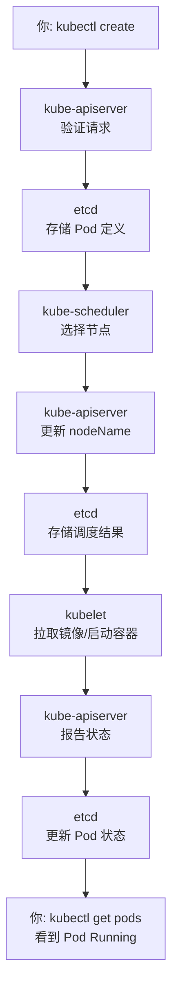

# Kubernetes 调度指南：从 `kubectl create` 到 Pod 运行

> 适合纯新手，用简单比喻理解 Kubernetes 核心组件如何协作

## 概述：Kubernetes 就像一个大工厂

想象你要在工厂里生产一批玩具（容器），Kubernetes 就是工厂的管理系统：

- **你（用户）**：下达生产指令
- **kube-apiserver**：工厂前台，接收所有指令
- **etcd**：工厂的中央档案室，记录所有订单和状态
- **kube-scheduler**：生产调度员，决定哪个车间生产
- **kubelet**：车间主任，负责具体生产
- **kube-controller-manager**：质量监督员，确保生产按计划进行

下面我们一步步看这个工厂如何运转。

---

## 组件详解：谁是谁？

### 1. kube-apiserver：工厂前台（集群大脑）

**比喻**：工厂的接待前台，所有内外沟通都必须通过这里。

**职责**：
- 接收你的指令（`kubectl create`、`kubectl apply`）
- 验证指令是否合法（格式正确、权限足够）
- 将指令翻译成工厂内部语言
- 把任务记录到中央档案室（etcd）
- 向其他组件分发任务

**关键点**：
- 它是 **唯一** 可以修改 etcd 的组件
- 所有组件都通过它相互通信
- 就像 HTTP 服务器，你通过 REST API 与它交互

### 2. etcd：中央档案室（集群记忆）

**比喻**：工厂的档案柜，存放所有订单、生产进度、员工信息。

**职责**：
- 持久化存储所有集群数据
- 记录 Pod 定义、节点状态、配置信息
- 保证数据一致性（分布式存储）
- 快速响应查询请求

**关键点**：
- 不是数据库，是键值存储（类似 Redis）
- 数据以 `key-value` 形式存放
- 高可用配置（通常 3 或 5 个副本）

### 3. kube-scheduler：调度裁判（资源分配专家）

**比喻**：生产调度员，查看哪个车间有闲置机器和原材料。

**职责**：
- 监控“未调度”的 Pod（还没有分配车间的生产任务）
- 根据规则选择最合适的节点（车间）
- 考虑因素：CPU、内存、磁盘、标签、亲和性等
- 不负责实际生产，只做分配决策

**调度决策过程**：
1. **过滤**：排除不满足要求的节点（如资源不足）
2. **打分**：给剩余节点打分（如资源利用率、亲和性）
3. **选择**：选择分数最高的节点

### 4. kubelet：车间主任（节点管家）

**比喻**：每个车间的主任，负责本车间的具体生产。

**职责**：
- 监听分配给本节点的 Pod 任务
- 拉取容器镜像（从仓库下载玩具模具）
- 启动/停止容器（开始生产）
- 监控容器健康状态（定期检查产品质量）
- 向工厂前台报告生产进度

**关键点**：
- 每个节点（机器）上都有一个 kubelet
- 只管理本节点上的容器
- 通过 CRI（容器运行时接口）与 Docker/containerd 交互

### 5. kube-controller-manager：质量监督员（状态同步器）

**比喻**：在工厂巡逻的监督员，确保实际生产与计划一致。

**职责**：
- 运行各种“控制器”，每种控制器关注一种资源
- 比较“期望状态”（你下的订单）和“实际状态”（当前生产）
- 如果不一致，采取措施修复（如重启失败的容器）

**常见控制器**：
- **Deployment 控制器**：确保指定数量的 Pod 在运行
- **Node 控制器**：监控节点健康状况
- **Service 控制器**：管理负载均衡和服务发现

---

## 调度流程：一步步看玩具如何生产

让我们跟着一个具体的例子：`kubectl create -f toy-pod.yaml`

### 第 1 步：你下达生产指令
```bash
# 你告诉工厂：“我要生产一个玩具！”
kubectl create -f toy-pod.yaml
```
- `toy-pod.yaml` 是你的生产图纸（Pod 定义）
- `kubectl` 是你的对讲机，连接到工厂前台

### 第 2 步：前台接收并验证
```
你 (kubectl create)
   ↓
kube-apiserver（工厂前台）
```
- 前台检查：图纸格式正确吗？你有权限下这个订单吗？
- 验证通过后，前台将订单抄写到档案室

### 第 3 步：存档到中央档案室
```
kube-apiserver
   ↓
etcd（中央档案室）
```
- 档案室记录：“订单 #001：生产玩具 Pod，状态：待调度”
- 此时 Pod 的 `nodeName` 字段为空（还没决定在哪个车间生产）

### 第 4 步：调度员分配车间
```
etcd
   ↓
kube-scheduler（调度员）
```
调度员每隔几秒检查档案室：
1. 发现“待调度”的 Pod（`nodeName` 为空）
2. 查看所有车间（节点）状态：
   - 车间 A：CPU 还剩 2 核，内存 4GB
   - 车间 B：CPU 还剩 1 核，内存 2GB
   - 车间 C：没有所需机器（如 GPU）
3. 根据规则选择车间 B（假设最合适）
4. 告诉前台：“订单 #001 分配给车间 B”

### 第 5 步：更新分配结果
```
kube-scheduler
   ↓
kube-apiserver
   ↓
etcd
```
- 前台更新档案室记录：“订单 #001 → 车间 B”
- Pod 的 `nodeName` 字段现在填写为“node-b”

### 第 6 步：车间主任开始生产
```
etcd
   ↓
kube-apiserver
   ↓
kubelet（车间 B 主任）
```
车间主任（kubelet）一直监听前台广播：
- 听到：“车间 B 有新订单 #001”
- 查看订单详情：需要什么镜像、多少资源
- 从仓库拉取镜像（如 `docker pull toy-image:latest`）
- 启动容器（如 `docker run toy-image`）

### 第 7 步：报告生产进度
```
kubelet
   ↓
kube-apiserver
   ↓
etcd
```
- 车间主任定期报告：“订单 #001 生产中，状态：Running”
- 档案室更新状态
- 你通过 `kubectl get pods` 可以看到状态变化

---

## 可视化流程



---

## 常见问题与调试

### 1. 如何查看调度结果？
```bash
# 查看 Pod 被调度到哪个节点
kubectl get pods -o wide

# 查看 Pod 的详细信息（包括调度事件）
kubectl describe pod <pod-name>
```

### 2. 如果 Pod 一直 Pending？
可能原因：
- **资源不足**：没有节点满足 CPU/内存要求
- **节点选择器不匹配**：Pod 指定了 `nodeSelector`，但没有匹配的节点
- **污点容忍**：节点有污点（taint），Pod 没有相应容忍（toleration）

检查命令：
```bash
# 查看 Pod 的调度事件
kubectl describe pod <pod-name> | grep -A 10 Events

# 查看节点资源
kubectl describe nodes
```

### 3. 如何手动调度 Pod？
通常让调度器自动决定，但可以强制指定：
```yaml
# 在 Pod 定义中添加
spec:
  nodeName: "node-b"  # 直接指定节点名
```

### 4. 调度器如何选择节点？
调度器考虑因素（按常见权重）：
1. **资源请求**：CPU、内存必须满足
2. **节点选择器/亲和性**：标签匹配
3. **污点与容忍**：是否允许在特殊节点运行
4. **资源平衡**：倾向于选择负载较低的节点
5. **拓扑约束**：如跨机架、跨可用区分布

---

## 关键点总结

| 组件 | 一句话总结 | 新手记忆法 |
|------|-----------|------------|
| **kube-apiserver** | 所有请求的入口和出口 | “工厂前台，唯一可以修改档案室的人” |
| **etcd** | 存储所有集群状态 | “中央档案室，集群的记忆” |
| **kube-scheduler** | 决定 Pod 去哪台机器 | “调度裁判，只分配不执行” |
| **kubelet** | 在节点上管理容器生命周期 | “车间主任，负责具体生产” |
| **kube-controller-manager** | 确保实际状态符合期望状态 | “质量监督员，修复偏差” |

### 记住这 5 个核心关系：
1. **你** → **kube-apiserver** → **etcd**（提交任务）
2. **kube-scheduler** 监控 **etcd** 中的待调度 Pod
3. **kube-scheduler** → **kube-apiserver** → **etcd**（更新分配）
4. **kubelet** 从 **kube-apiserver** 获取分配任务
5. **kubelet** → **kube-apiserver** → **etcd**（报告状态）

---

## 下一步学习建议

1. **动手实验**：
   ```bash
   # 1. 创建一个简单的 Pod
   kubectl run my-test --image=nginx:alpine
   
   # 2. 查看它被调度到哪里
   kubectl get pods -o wide
   
   # 3. 查看调度详情
   kubectl describe pod my-test
   ```

2. **深入主题**：
   - **节点亲和性**：让 Pod 更喜欢某些节点
   - **污点与容忍**：禁止/允许 Pod 到特定节点
   - **资源限制**：设置 CPU/内存请求和上限
   - **自定义调度器**：当默认调度器不满足需求时

3. **常用调试命令**：
   ```bash
   # 查看调度器日志
   kubectl logs -n kube-system kube-scheduler-xxxxx
   
   # 查看节点资源
   kubectl top nodes
   
   # 查看 Pod 资源使用
   kubectl top pods
   ```

---

## 最后：调度就像打车

- **你**：乘客，叫车（`kubectl create`）
- **kube-apiserver**：打车平台后台
- **etcd**：订单数据库
- **kube-scheduler**：派单系统（根据距离、车型、司机评分派单）
- **kubelet**：司机（接单、开车、报告位置）

下次你用 `kubectl` 时，想想背后这套精密的协作系统！

> 文档更新：2026-03-22  
> 作者：tenten（你的 AI 助手）  
> 适用：Kubernetes 新手，想理解核心调度流程